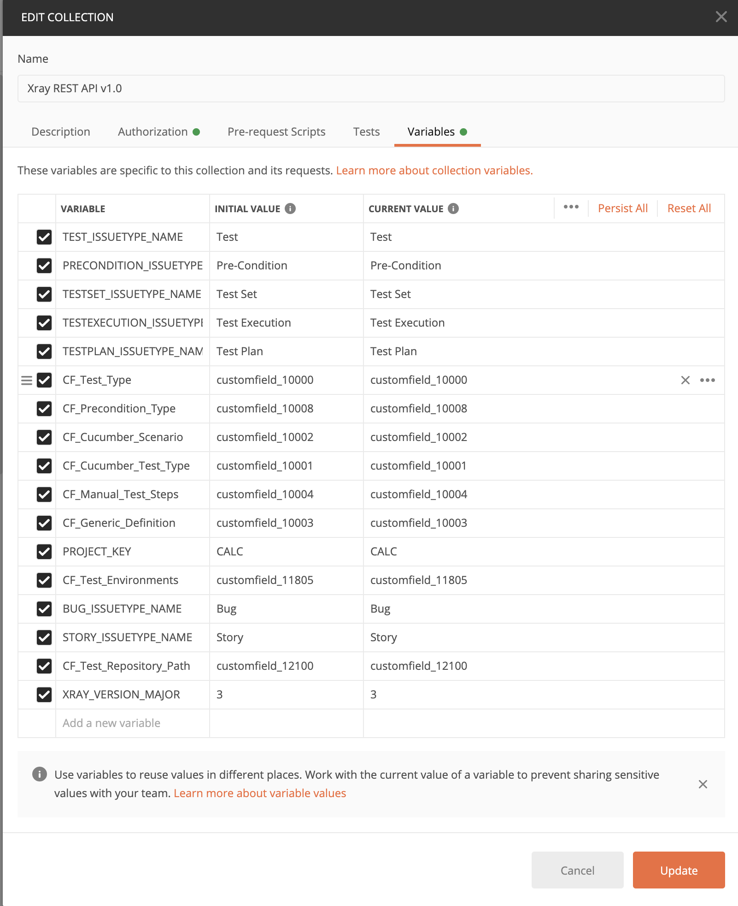
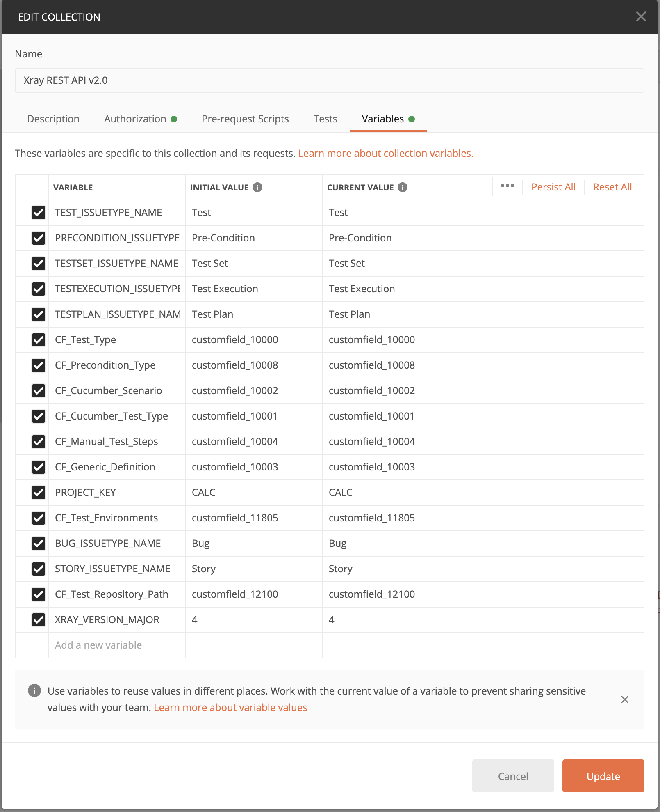
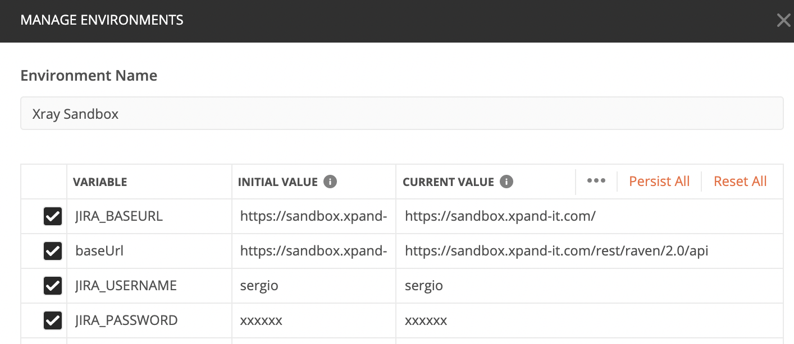
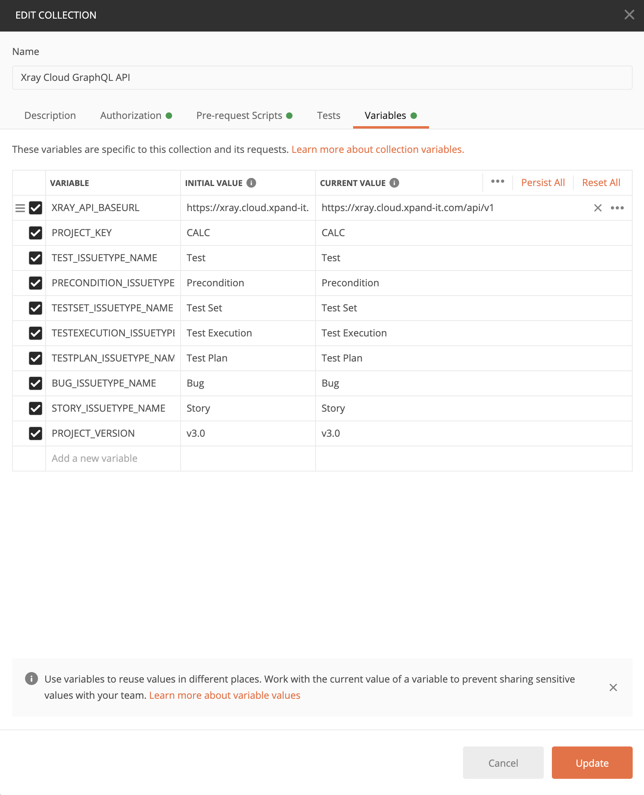

# Xray Postman Collections

- [Xray Postman Collections](#xray-postman-collections)
  * [Collections organization](#collections-organization)
  * [How to use the collections](#how-to-use-the-collections)
  * [APIs](#apis)
    + [Xray server (i.e. on Jira server/Datacenter)](#xray-server--ie-on-jira-server-datacenter-)
      - [REST API v1.0](#rest-api-v10)
      - [REST API v2.0](#rest-api-v20)
    + [Xray Cloud (i.e. on Jira Cloud)](#xray-cloud--ie-on-jira-cloud-)
      - [REST API v1](#rest-api-v1)
      - [GraphQL](#graphql)
  * [Questions](#questions)
  * [TO DO](#to-do)
  * [Disclaimer](#disclaimer)
  * [License](#license)

<small><i><a href='http://ecotrust-canada.github.io/markdown-toc/'>Table of contents generated with markdown-toc</a></i></small>

Here you can find some Postman collections that exemplify usage of [Xray Test Management](https://www.getxray.app/) public APIs.
The idea is to have some concrete examples of how to make certain, basic requests. Then you can play with them and adapt to your needs. It's easier to learn by example, isn't it?

APIs are used to obtain and update data; in Xray, most times they are used to import results from automation frameworks.
However, APIs allow to do a lot more: obtain entities, their relations and modify/delete them.

Although similar, Xray server/datacenter and Xray on Jira cloud are two different products with also slight different characteristics.
Xray on Jira server/DC has a pubic REST API. Xray on Jira Cloud has a REST API along with a GraphQL API. We'll discuss this ahead.

## Collections organization

The collection starts by some initial requests that populate the destination Jira instance with some data that will be used by the requests of the collection. These test data initialization requests are stored under the "setup" folder and will populate some global variables used by subsequent requests.

The actual requests are organized in multiple folders and subfolders, by the semantics of the requests/URL of endpoint calls. Each request has some basic Postman tests implemented as such, so you can assess their behaviour.

**Note:** Some few requests depend on the outcomes of previous requests.

## How to use the collections

First of all, you'll need [Postman](https://www.postman.com/) :-)
In Postman **you need to configure variables on the collection** adjusting them to the specifics of your environment.

**Examples**

Part of them, if not all, can be defined as environment variables; in this case you need to create an environment in Postman and define the variables there.

**Server specific variables, normally defined within a Postman environment**

 Variable          | example                                           
-------------------| --------------------------------------------------
 JIRA_BASEURL      | https://sandbox.xpand-it.com                      
 baseUrl           | https://sandbox.xpand-it.com/rest/raven/2.0/api   
 JIRA_USERNAME     | sergio                                            
 JIRA_PASSWORD     | xxxxxx                                            

**Example of environment configuration**

**Cloud specific variables, normally defined within a Postman environment**

 Variable          | example                                           
-------------------| --------------------------------------------------
 client_id         | 0011233... (obtained from a Xray API "key")      
 client_secret      | 0011233... (obtained from a Xray API "key")       
 JIRA_BASEURL      | https://sergiofreire.atlassian.net                
 JIRA_USERNAME     | sergio.freire@example.com                         
 JIRA_PASSWORD     | xxxxxx   (JIRA Api token)                         

**Example of environment configuration**

After adjusting the variables, it is recommended to run the requests in bulk using the collection runner in order to populate the variables (you could also run just the "setup" related requests).
Afterwards, you can send requests individually right from Postman's main screen (i.e. the editor).

## APIs

There are several APIs used to interact with Xray related entities:

- Jira REST API
- Xray REST API
- Xray GraphQL

Jira REST API can be used to access and manipulate Jira related entities (e.g. issues). As most Xray entities are issue type based, then you can create, delete and even update (to an extent) these using Jira REST API calls. As an example, creating a Test issue can be done using Jira REST API /issue call.
In order to use Jira REST API you need to authenticate (e.g. using basic auth and the Jira user credentials). More on Jira server/DC REST API [here](https://developer.atlassian.com/server/jira/platform/rest-apis/).
In [Jira Cloud](https://developer.atlassian.com/cloud/jira/platform/rest/) you need to use [API tokens](https://confluence.atlassian.com/cloud/api-tokens-938839638.html) and authenticate using them.

Xray REST APIs are used to manipulate data (e.g. importing results, obtain relations between entities); for historical reasons, Xray server/DC provides an extensive set of endpoints. The Xray REST API in Xray cloud is much more limited (GraphQL is preferred instead).
As Xray server/DC provides the REST API on top of Jira's REST API, it reuses the same authentication mechanisms provided by Jira (e.g. basic auth, OAuth).
In Xray cloud, a [specific authentication mechanism](https://docs.getxray.app/display/XRAYCLOUD/Authentication+-+REST) is used instead.

Xray GraphQL, as of July 2020, is only available in Xray on Jira cloud. It provides an extensive set of features, allowing you to query and update Xray related data. This is the preferred API for Xray cloud, even though some features (e.g. importing results) are only available in the Xray REST API.

### Xray server (i.e. on Jira server/Datacenter)

#### REST API v1.0

[Version 1.0](https://docs.getxray.app/display/XRAY/v1.0) has been provided until Xray v3.6.x.
It provides the ability to obtain and update Xray related entities and their relations. It also provides the necessary endpoints to import/export tests and test results.
Unfortunately, not all endpoints are RESTful compliant due to some minor incompabilities.
Xray REST API reuses the same authentication mechanism used by Jira's REST API.

Examples for this API are provided in [this collection](Xray%20REST%20API%20v1.0.postman_collection.json).

#### REST API v2.0

[Version 2.0](https://docs.getxray.app/display/XRAY/v2.0) is available since Xray v4.0. This is an evolution over the previous Xray REST v1.0 version, providing additional endpoints for dealing with test step and test run custom fields.
Xray REST API reuses the same authentication mechanism used by Jira's REST API.

Examples for this API are provided in [this collection](Xray%20REST%20API%20v2.0.postman_collection.json).

### Xray Cloud (i.e. on Jira Cloud)

Before performing any request on Xray related endpoints, you'll need to have a [Xray API key](https://docs.getxray.app/display/XRAYCLOUD/Global+Settings%3A+API+Keys) (i.e. client_id + client_secret), so that you can authenticate against Xray (more info [here](https://docs.getxray.app/display/XRAYCLOUD/Authentication+-+REST)).
This will create a token that you'll need to use in following requests.

Note: Xray cloud APIs are rate/resource limited, so you should have that in mind. More info [here](https://docs.getxray.app/display/XRAYCLOUD/GraphQL+API).

Examples for the public APIs (REST and GraphQL based) are provided in the same [collection](Xray%20Cloud%20GraphQL%20API.postman_collection).

You need to define some variables (client_id, client_secret) in a Postman environment used and assigned to run the collection.

#### REST API v1

Xray cloud provides a [basic REST API](https://docs.getxray.app/display/XRAYCLOUD/REST+API) that is mostly used to import test automation related results, similarly to the Xray server/DC REST APIs.
There are some additional, unrelated calls though.
Note that GraphQL is the preferred API for managing entities.
Your requests need to be authenticated, using the token obtained in the respective REST API v1 call mentioned earlier.

#### GraphQL

Besides a basic REST API, Xray cloud also provides a [GraphQL API](https://docs.getxray.app/display/XRAYCLOUD/GraphQL+API) which is quite extensive and allows to query and updte data easily.
Querying with GraphQL is more flexible and efficient, as you can make one request to obtain entities, the fields you needs, relations, fields on the related entities, etc.
Your requests need to be authenticated, using the token obtained in the respective REST API v1 call mentioned earlier.

Note: GraphQL is instrospective, so you should be able to use it rightaway if your client support it. The [Insomnia tool](https://insomnia.rest/) tool supports this; Postman not yet, as of July 2020.

## Questions

* _What happens if I run the whole collection?_
Some data, including Jira issues, will be created on the destination instance

* _Will this delete any existing data in my Jira instance?_
It shouldn't but it depends on your usage. Please see the disclaimer ahead.

* _I have some questions..._
Well, if you have a Xray license, including trials, you can reach out to Xray support for general API and Xray usage questions. However, questions related to this specific open-source project are not covered/handled by Xray support.

* _I have some suggestions..._
You can reach out to me on [Twitter](https://www.twitter.com/darktelecom). However, please don't use to make support requests :)

* _Do you have some environment where I can test this on?_
For Xray on Jira server/DC you can use our sandbox environment; you'll need to crete a Jira user there.
For Xray on Jira cloud, you can create a free Jira cloud instance and then install the Xray app.
In any case, you'll need to have a Jira project pre-created and configured properly with Xray entities.

* _Can I use these collections in my existent Jira instance?_
Yes, at your own risk :-)
If you want to perform some tests, you should create a specific playground kind of project. Read-type of requests can be performed on any existing project.

* _What is the best way to manage variables in Postman?_
You can keep some variables at the collection level and other at the enviroment level. Well, you can put all your collection variables inside a Postman environment and manage it there, since they will most proabably change between different Jira instances.

## TO DO

- cleanup variable names and some redundancy
- evaluate usage of global variables
- import automation results using multipart endpoints

## Disclaimer

This collection is provided as-is. No guarantees whatsoever.

## License

[BSD 3-clause](LICENSE)
